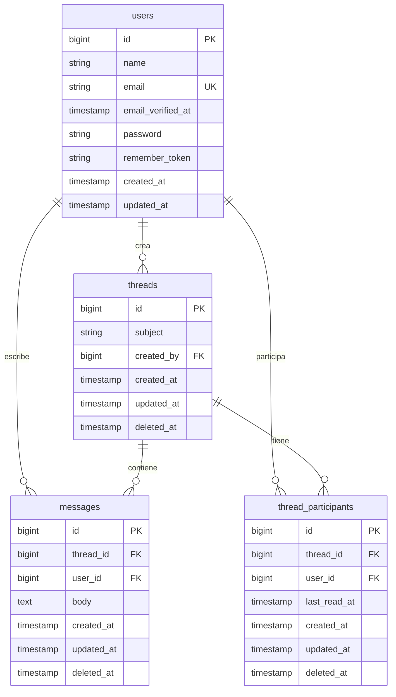

# Sistema de Mensajería - Inbox

Aplicación Full-Stack de sistema de mensajería tipo "inbox" desarrollada con Laravel (Backend) y React+TypeScript (Frontend).

## 🎯 Prueba Técnica - Desarrollador Senior Laravel

Este proyecto es parte de una prueba técnica que implementa un sistema de mensajería interno similar a plataformas de soporte o correo electrónico.

## 📋 Requisitos Previos

### Backend (Laravel)
- PHP >= 7.3
- Composer
- MySQL o PostgreSQL
- Extensiones PHP: OpenSSL, PDO, Mbstring, Tokenizer, XML, Ctype, JSON

### Frontend (React)
- Node.js >= 14.18
- npm o yarn

## 🚀 Instalación

### 1. Clonar el Repositorio

```bash
git clone <repository-url>
cd proyect
```

### 2. Configurar Backend (Laravel)

```bash
# Instalar dependencias
composer install

# Configurar archivo de entorno
cp .env.example .env

# Generar key de aplicación
php artisan key:generate

# Configurar base de datos en .env
# DB_DATABASE=inbox_db
# DB_USERNAME=tu_usuario
# DB_PASSWORD=tu_password

# Ejecutar migraciones
php artisan migrate

# (Opcional) Ejecutar seeders para datos de prueba
php artisan db:seed

# Iniciar servidor de desarrollo
php artisan serve
```

El backend estará disponible en `http://localhost:8000`

### 3. Configurar Frontend (React + TypeScript)

```bash
# Navegar a la carpeta del cliente
cd client

# Instalar dependencias
npm install

# Configurar archivo de entorno
cp .env.example .env

# Iniciar servidor de desarrollo
npm run dev
```

El frontend estará disponible en `http://localhost:3000`

## 📁 Estructura del Proyecto

```
proyect/                     # Raíz del proyecto Laravel
├── app/
│   ├── Http/
│   │   ├── Controllers/     # Controladores API
│   │   └── Middleware/
│   └── Models/              # Modelos Eloquent
│
├── client/                  # Aplicación React
│   ├── src/
│   │   ├── components/      # Componentes reutilizables
│   │   ├── pages/           # Páginas/vistas
│   │   ├── services/        # Servicios API
│   │   └── types/           # Tipos TypeScript
│   └── package.json
│
├── database/
│   ├── migrations/          # Migraciones de BD
│   └── seeders/             # Datos de prueba
│
├── routes/
│   └── api.php              # Rutas de API
│
├── tests/                   # Tests PHPUnit
├── Test.md                  # Especificaciones
└── README.md                # Este archivo
```

## �️ Base de Datos

### Diagrama de Tablas y Relaciones



**Características:**
- 🗑️ **Soft Deletes**: `threads`, `messages`, `thread_participants`
- 📖 **Tracking de lectura**: Campo `last_read_at` en participantes
- 🔑 **Integridad referencial**: Foreign keys con cascada
- 📧 **Email único**: Constraint en tabla `users`

Ver [documentación completa de la base de datos](docs/database-diagram.md)

## �🔑 Características Principales

### Backend API
- ✅ Autenticación JWT
- ✅ CRUD de conversaciones (threads)
- ✅ CRUD de mensajes
- ✅ Sistema de participantes
- ✅ Paginación y filtros
- ✅ Validaciones robustas
- ✅ CORS configurado
- ✅ Tests unitarios y de integración

### Frontend
- ✅ Autenticación de usuarios
- ✅ Lista de conversaciones
- ✅ Vista de mensajes por hilo
- ✅ Crear nuevas conversaciones
- ✅ Responder a mensajes
- ✅ Diseño responsivo
- ✅ Manejo de estados con React Context
- ✅ Cliente HTTP con Axios
- ✅ Tests con Jest y React Testing Library

## 📚 API Endpoints

### Autenticación
```
POST   /api/auth/register    - Registro de usuario
POST   /api/auth/login       - Iniciar sesión
POST   /api/auth/logout      - Cerrar sesión
GET    /api/auth/me          - Obtener usuario actual
POST   /api/auth/refresh     - Renovar token
```

### Conversaciones (Threads)
```
GET    /api/threads          - Listar conversaciones (paginadas)
POST   /api/threads          - Crear conversación
GET    /api/threads/{id}     - Ver detalles + mensajes
DELETE /api/threads/{id}     - Eliminar conversación
```

### Mensajes
```
POST   /api/threads/{id}/messages  - Enviar mensaje en hilo
GET    /api/messages/unread        - Contar mensajes no leídos
POST   /api/messages/{id}/read     - Marcar mensaje como leído
```

## 🧪 Tests

### Backend (PHPUnit)
```bash
# Ejecutar todos los tests
php artisan test

# Tests con cobertura
php artisan test --coverage
```

### Frontend (Jest)
```bash
cd client
npm run test
```

## 🛠️ Tecnologías Utilizadas

### Backend
- **Laravel 8** - Framework PHP
- **JWT Auth (tymon/jwt-auth)** - Autenticación
- **MySQL/PostgreSQL** - Base de datos
- **PHPUnit** - Testing

### Frontend
- **React 18** - Librería UI
- **TypeScript** - Tipado estático
- **Vite** - Build tool moderno
- **Axios** - Cliente HTTP
- **React Router** - Navegación
- **Jest** - Testing

## 🔧 Configuración Adicional

### Variables de Entorno Backend (.env)
```env
DB_CONNECTION=mysql
DB_HOST=127.0.0.1
DB_PORT=3306
DB_DATABASE=inbox_db
DB_USERNAME=root
DB_PASSWORD=

JWT_SECRET=tu_secret_generado
```

### Variables de Entorno Frontend (client/.env)
```env
VITE_API_BASE_URL=http://localhost:8000/api
```

## 📝 Notas sobre uso de IA

Este proyecto fue desarrollado con apoyo de herramientas de Inteligencia Artificial (GitHub Copilot) según lo permitido en la prueba técnica:

✅ **Fragmentos adaptados:**
- Configuración inicial de JWT Auth
- Estructura base de componentes React
- Configuraciones de TypeScript y Vite

✅ **Código personalizado y validado:**
- Toda la lógica de negocio fue revisada
- Tests implementados manualmente
- Arquitectura diseñada específicamente para el proyecto
- Validaciones y reglas de negocio adaptadas

## 🚀 Despliegue

### Backend
- Configurar servidor con PHP 7.3+
- Instalar Composer
- Configurar base de datos
- Ejecutar migraciones
- Configurar variables de entorno de producción

### Frontend
- Build de producción: `npm run build`
- Servir carpeta `dist/` con servidor web (Nginx, Apache, etc.)
- O integrar en Laravel con: `php artisan serve --host=0.0.0.0`

## 👤 Autor

**Jesús Santiago**
- Email: jesus.santiago@example.com

## 📄 Licencia

Este proyecto es parte de una prueba técnica.

---

Desarrollado con ❤️ usando Laravel y React
