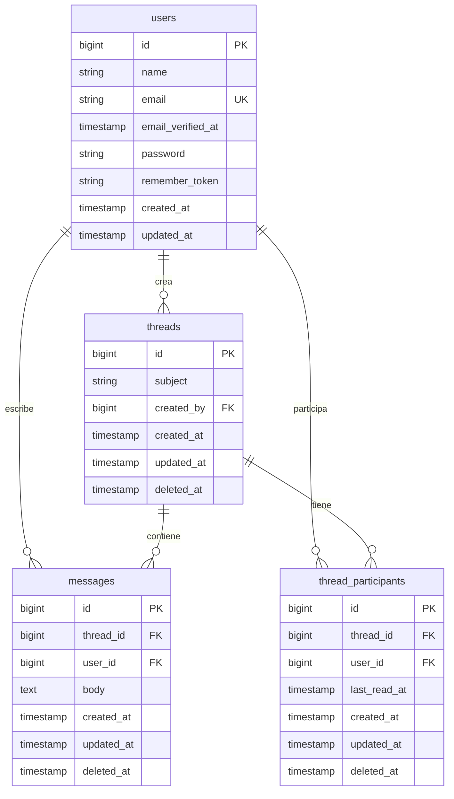

# Sistema de Mensajería - Inbox

Aplicación Full-Stack de sistema de mensajería tipo "inbox" desarrollada con Laravel (Backend) y React+TypeScript (Frontend).

## 🎯 Prueba Técnica - Desarrollador Senior Laravel

Este proyecto es parte de una prueba técnica que implementa un sistema de mensajería interno similar a plataformas de soporte o correo electrónico.

## 📋 Requisitos Previos

### Backend (Laravel)
- PHP >= 7.3
- Composer
- MySQL o PostgreSQL
- Extensiones PHP: OpenSSL, PDO, Mbstring, Tokenizer, XML, Ctype, JSON

### Frontend (React)
- Node.js >= 14.18
- npm o yarn

## 🚀 Instalación

### 1. Clonar el Repositorio

```bash
git clone <repository-url>
cd proyect
```

### 2. Configurar Backend (Laravel)

```bash
# Instalar dependencias
composer install

# Configurar archivo de entorno
cp .env.example .env

# Generar key de aplicación
php artisan key:generate

# Configurar base de datos en .env
# DB_DATABASE=inbox_db
# DB_USERNAME=tu_usuario
# DB_PASSWORD=tu_password

# Ejecutar migraciones
php artisan migrate

# Ejecutar seeders para crear usuarios de prueba
php artisan db:seed
# Crea 2 usuarios:
#   Admin: admin@inbox.com / admin123
#   User: user@inbox.com / user123

# Iniciar servidor de desarrollo
php artisan serve
```

El backend estará disponible en `http://localhost:8000`

### 3. Configurar Frontend (React + TypeScript)

```bash
# Navegar a la carpeta del cliente
cd client

# Instalar dependencias
npm install

# Configurar archivo de entorno
cp .env.example .env

# Iniciar servidor de desarrollo
npm run dev
```

El frontend estará disponible en `http://localhost:3000`

## 📁 Estructura del Proyecto

```
proyect/                     # Raíz del proyecto Laravel
├── app/
│   ├── Http/
│   │   ├── Controllers/     # Controladores API
│   │   └── Middleware/
│   └── Models/              # Modelos Eloquent
│
├── client/                  # Aplicación React
│   ├── src/
│   │   ├── components/      # Componentes reutilizables
│   │   ├── pages/           # Páginas/vistas
│   │   ├── services/        # Servicios API
│   │   └── types/           # Tipos TypeScript
│   └── package.json
│
├── database/
│   ├── migrations/          # Migraciones de BD
│   └── seeders/             # Datos de prueba
│
├── routes/
│   └── api.php              # Rutas de API
│
├── tests/                   # Tests PHPUnit
├── Test.md                  # Especificaciones
└── README.md                # Este archivo
```

## �️ Base de Datos

### Diagrama de Tablas y Relaciones



**Características:**
- 🗑️ **Soft Deletes**: `threads`, `messages`, `thread_participants`
- 📖 **Tracking de lectura**: Campo `last_read_at` en participantes
- 🔑 **Integridad referencial**: Foreign keys con cascada
- 📧 **Email único**: Constraint en tabla `users`

## 🔑 Características Principales

### Backend API
- ✅ Autenticación JWT (tymon/jwt-auth v1.0)
- ✅ Sistema de roles (admin/user)
- ✅ CRUD de conversaciones (threads)
- ✅ CRUD de mensajes
- ✅ Sistema de participantes
- ✅ Control de permisos por rol
- ✅ Paginación y filtros
- ✅ Validaciones robustas
- ✅ CORS configurado
- ✅ Tests unitarios y de integración (32 tests pasando)

### Frontend
- ✅ Autenticación de usuarios
- ✅ Lista de conversaciones
- ✅ Vista de mensajes por hilo
- ✅ Crear nuevas conversaciones
- ✅ Responder a mensajes
- ✅ Diseño responsivo
- ✅ Manejo de estados con React Context
- ✅ Cliente HTTP con Axios
- ✅ Tests con Jest y React Testing Library

## 📚 API Endpoints

### Base URL
```
http://localhost:8000/api
```

### Autenticación

Todos los endpoints protegidos requieren header:
```
Authorization: Bearer {token}
```

### Sistema de Roles

El sistema implementa dos roles:

- **admin**: Puede ver y gestionar TODOS los threads y mensajes del sistema
- **user** (default): Solo puede ver threads donde es creador o participante

**Permisos por rol:**

| Acción | User | Admin |
|--------|------|-------|
| Ver sus threads | ✅ | ✅ Ver TODOS |
| Crear thread | ✅ | ✅ |
| Ver thread donde participa | ✅ | ✅ Ver CUALQUIERA |
| Eliminar thread creado | ✅ | ✅ Eliminar CUALQUIERA |
| Enviar mensaje donde participa | ✅ | ✅ En CUALQUIER thread |

---

### 🔐 POST /api/auth/register
Registrar un nuevo usuario.

**Request Body:**
```json
{
  "name": "Juan Pérez",
  "email": "juan@example.com",
  "password": "password123",
  "password_confirmation": "password123",
  "role": "user"
}
```

**Campos:**
- `name` (requerido): Nombre del usuario
- `email` (requerido): Email único
- `password` (requerido): Mínimo 6 caracteres
- `password_confirmation` (requerido): Debe coincidir con password
- `role` (opcional): "user" o "admin" (default: "user")

**Response (201 Created):**
```json
{
  "success": true,
  "message": "User registered successfully",
  "user": {
    "id": 1,
    "name": "Juan Pérez",
    "email": "juan@example.com",
    "role": "user",
    "created_at": "2026-02-08T01:00:00.000000Z",
    "updated_at": "2026-02-08T01:00:00.000000Z"
  },
  "authorization": {
    "token": "eyJ0eXAiOiJKV1QiLCJhbGciOiJIUzI1NiJ9...",
    "type": "bearer"
  }
}
```

**Errores:**
- `422 Unprocessable Entity` - Validación fallida

---

### 🔐 POST /api/auth/login
Iniciar sesión.

**Request Body:**
```json
{
  "email": "juan@example.com",
  "password": "password123"
}
```

**Response (200 OK):**
```json
{
  "success": true,
  "user": {
    "id": 1,
    "name": "Juan Pérez",
    "email": "juan@example.com",
    "email_verified_at": null,
    "created_at": "2026-02-08T01:00:00.000000Z",
    "updated_at": "2026-02-08T01:00:00.000000Z"
  },
  "authorization": {
    "token": "eyJ0eXAiOiJKV1QiLCJhbGciOiJIUzI1NiJ9...",
    "type": "bearer"
  }
}
```

**Errores:**
- `401 Unauthorized` - Credenciales inválidas

---

### 🔐 GET /api/auth/me
Obtener usuario autenticado.

**Headers:**
```
Authorization: Bearer {token}
```

**Response (200 OK):**
```json
{
  "success": true,
  "user": {
    "id": 1,
    "name": "Juan Pérez",
    "email": "juan@example.com",
    "email_verified_at": null,
    "created_at": "2026-02-08T01:00:00.000000Z",
    "updated_at": "2026-02-08T01:00:00.000000Z"
  }
}
```

---

### 🔐 POST /api/auth/logout
Cerrar sesión (invalidar token).

**Headers:**
```
Authorization: Bearer {token}
```

**Response (200 OK):**
```json
{
  "success": true,
  "message": "Successfully logged out"
}
```

---

### 🔐 POST /api/auth/refresh
Refrescar token JWT.

**Headers:**
```
Authorization: Bearer {token}
```

**Response (200 OK):**
```json
{
  "success": true,
  "user": { ... },
  "authorization": {
    "token": "nuevo_token_jwt...",
    "type": "bearer"
  }
}
```

---

### 💬 GET /api/threads
Listar conversaciones del usuario autenticado.

**Headers:**
```
Authorization: Bearer {token}
```

**Query Parameters:**
- `page` (opcional): Número de página (default: 1)

**Response (200 OK):**
```json
{
  "success": true,
  "data": {
    "current_page": 1,
    "data": [
      {
        "id": 1,
        "subject": "Reunión de proyecto",
        "created_by": 1,
        "created_at": "2026-02-08T01:00:00.000000Z",
        "updated_at": "2026-02-08T02:30:00.000000Z",
        "deleted_at": null,
        "messages_count": 5,
        "creator": {
          "id": 1,
          "name": "Juan Pérez",
          "email": "juan@example.com"
        },
        "latest_message": {
          "id": 5,
          "body": "Último mensaje del thread",
          "created_at": "2026-02-08T02:30:00.000000Z",
          "user": {
            "id": 2,
            "name": "María López"
          }
        },
        "participants": [
          {
            "id": 1,
            "name": "Juan Pérez",
            "pivot": {
              "last_read_at": "2026-02-08T02:25:00.000000Z"
            }
          },
          {
            "id": 2,
            "name": "María López",
            "pivot": {
              "last_read_at": null
            }
          }
        ]
      }
    ],
    "per_page": 15,
    "total": 1
  }
}
```

---

### 💬 POST /api/threads
Crear nueva conversación.

**Headers:**
```
Authorization: Bearer {token}
```

**Request Body:**
```json
{
  "subject": "Reunión de proyecto",
  "body": "Hola, necesitamos coordinar la reunión",
  "participants": [2, 3]
}
```

**Response (201 Created):**
```json
{
  "success": true,
  "message": "Thread created successfully",
  "data": {
    "id": 1,
    "subject": "Reunión de proyecto",
    "created_by": 1,
    "created_at": "2026-02-08T01:00:00.000000Z",
    "messages": [
      {
        "id": 1,
        "body": "Hola, necesitamos coordinar la reunión",
        "user_id": 1,
        "user": {
          "id": 1,
          "name": "Juan Pérez"
        }
      }
    ],
    "participants": [...]
  }
}
```

**Errores:**
- `422 Unprocessable Entity` - Validación fallida (subject, body o participants requeridos)

---

### 💬 GET /api/threads/{id}
Ver detalles y mensajes de una conversación.

**Headers:**
```
Authorization: Bearer {token}
```

**Response (200 OK):**
```json
{
  "success": true,
  "data": {
    "id": 1,
    "subject": "Reunión de proyecto",
    "created_by": 1,
    "created_at": "2026-02-08T01:00:00.000000Z",
    "updated_at": "2026-02-08T02:30:00.000000Z",
    "messages": [
      {
        "id": 1,
        "body": "Primer mensaje",
        "user_id": 1,
        "created_at": "2026-02-08T01:00:00.000000Z",
        "user": {
          "id": 1,
          "name": "Juan Pérez",
          "email": "juan@example.com"
        }
      },
      {
        "id": 2,
        "body": "Respuesta al mensaje",
        "user_id": 2,
        "created_at": "2026-02-08T01:15:00.000000Z",
        "user": {
          "id": 2,
          "name": "María López"
        }
      }
    ],
    "participants": [...]
  }
}
```

**Errores:**
- `404 Not Found` - Thread no existe o usuario no es participante

**Nota:** Este endpoint actualiza automáticamente el campo `last_read_at` del usuario.

---

### 💬 DELETE /api/threads/{id}
Eliminar conversación (soft delete).

**Headers:**
```
Authorization: Bearer {token}
```

**Response (200 OK):**
```json
{
  "success": true,
  "message": "Thread deleted successfully"
}
```

**Errores:**
- `403 Forbidden` - Solo el creador puede eliminar el thread
- `404 Not Found` - Thread no existe

---

### 💬 POST /api/threads/{threadId}/messages
Enviar mensaje en una conversación.

**Headers:**
```
Authorization: Bearer {token}
```

**Request Body:**
```json
{
  "body": "Este es mi mensaje de respuesta"
}
```

**Response (201 Created):**
```json
{
  "success": true,
  "message": "Message sent successfully",
  "data": {
    "id": 3,
    "thread_id": 1,
    "user_id": 1,
    "body": "Este es mi mensaje de respuesta",
    "created_at": "2026-02-08T03:00:00.000000Z",
    "updated_at": "2026-02-08T03:00:00.000000Z",
    "user": {
      "id": 1,
      "name": "Juan Pérez",
      "email": "juan@example.com"
    }
  }
}
```

**Errores:**
- `404 Not Found` - Thread no existe o usuario no es participante
- `422 Unprocessable Entity` - Body requerido

## 🧪 Tests

### Backend (PHPUnit)

El proyecto incluye **25 tests** que cubren:
- ✅ Autenticación JWT (8 tests)
- ✅ CRUD de Threads (9 tests)
- ✅ Mensajes (6 tests)
- ✅ Validaciones y permisos
- ✅ Soft deletes
- ✅ Tracking de lectura

```bash
# Ejecutar todos los tests
php artisan test

# Tests con cobertura
php artisan test --coverage

# Test específico
php artisan test --filter AuthTest
```

**Resultado actual:**
```
Tests:   32 passed (182 assertions)
Time:    3.43s
```

**Detalles de tests implementados:**

#### AuthTest (11 tests)
- `test_usuario_puede_registrarse` - Registro exitoso con JWT
- `test_no_puede_registrarse_con_email_duplicado` - Validación email único
- `test_usuario_puede_hacer_login` - Login con credenciales válidas
- `test_login_falla_con_credenciales_invalidas` - Validación login
- `test_puede_obtener_usuario_autenticado` - Endpoint /me
- `test_me_falla_sin_autenticacion` - Protección de rutas
- `test_usuario_puede_hacer_logout` - Invalidación de token
- `test_puede_refrescar_token` - Renovación de JWT
- `test_usuario_registrado_tiene_rol_user_por_defecto` - Rol default
- `test_usuario_puede_registrarse_como_admin` - Registro admin
- `test_registro_valida_rol_valido` - Validación de roles

#### ThreadTest (12 tests)
- `test_usuario_puede_ver_sus_threads` - Listar threads con paginación
- `test_usuario_puede_crear_thread` - Crear thread con participantes
- `test_crear_thread_requiere_autenticacion` - Protección endpoints
- `test_crear_thread_valida_datos_requeridos` - Validación campos
- `test_participante_puede_ver_detalles_del_thread` - Ver mensajes
- `test_no_participante_no_puede_ver_thread` - Control de acceso
- `test_creador_puede_eliminar_thread` - Soft delete por creador
- `test_no_creador_no_puede_eliminar_thread` - Permisos eliminación
- `test_ver_thread_marca_como_leido` - Actualización last_read_at
- `test_admin_puede_ver_todos_los_threads` - Admin ve todos
- `test_admin_puede_ver_cualquier_thread` - Admin acceso total
- `test_admin_puede_eliminar_cualquier_thread` - Admin delete cualquiera

#### MessageTest (7 tests)
- `test_participante_puede_crear_mensaje_en_thread` - Crear mensaje
- `test_crear_mensaje_requiere_autenticacion` - Protección
- `test_crear_mensaje_valida_body_requerido` - Validación body
- `test_no_participante_no_puede_crear_mensaje` - Permisos
- `test_crear_mensaje_actualiza_timestamp_del_thread` - updated_at
- `test_crear_mensaje_en_thread_inexistente_falla` - Validación thread
- `test_admin_puede_crear_mensaje_en_cualquier_thread` - Admin send message anywhere

### Frontend (Jest)
```bash
cd client
npm run test
```

**Pendiente de implementación**

## 🛠️ Tecnologías Utilizadas

### Backend
- **Laravel 8.83.29** - Framework PHP
- **JWT Auth (tymon/jwt-auth v1.0)** - Autenticación
- **PHP 8.1.34** - Lenguaje de programación
- **MySQL 8.4** - Base de datos
- **PHPUnit** - Testing framework
- **Faker** - Generación de datos de prueba
- **PSR-12** - Estándar de código

### Frontend
- **React 18** - Librería UI
- **TypeScript** - Tipado estático
- **Vite** - Build tool moderno
- **Axios** - Cliente HTTP (pendiente)
- **React Router** - Navegación (pendiente)
- **Jest** - Testing (pendiente)

## 🔧 Configuración Adicional

### Variables de Entorno Backend (.env)
```env
DB_CONNECTION=mysql
DB_HOST=127.0.0.1
DB_PORT=3306
DB_DATABASE=inbox_db
DB_USERNAME=root
DB_PASSWORD=

JWT_SECRET=tu_secret_generado
```

### Variables de Entorno Frontend (client/.env)
```env
VITE_API_BASE_URL=http://localhost:8000/api
```

### Usuarios de Prueba

El seeder crea automáticamente dos usuarios para facilitar el testing:

| Rol | Email | Password | Permisos |
|-----|-------|----------|----------|
| **Admin** | admin@inbox.com | admin123 | Acceso total a todos los threads y mensajes |
| **User** | user@inbox.com | user123 | Solo threads donde participa o creó |

**Para crear los usuarios:**
```bash
php artisan db:seed
```

**Para resetear la base de datos y crear usuarios:**
```bash
php artisan migrate:fresh --seed
```

## 📝 Notas sobre uso de IA

Este proyecto fue desarrollado con apoyo de herramientas de Inteligencia Artificial (GitHub Copilot) según lo permitido en la prueba técnica:

✅ **Fragmentos adaptados:**
- Estructura base de componentes React
- Configuraciones de TypeScript y Vite

✅ **Código personalizado y validado:**
- Toda la lógica de negocio fue revisada
- Tests implementados manualmente
- Arquitectura diseñada específicamente para el proyecto
- Validaciones y reglas de negocio adaptadas

## 🚀 Despliegue

### Backend
- Configurar servidor con PHP 7.3+
- Instalar Composer
- Configurar base de datos
- Ejecutar migraciones
- Configurar variables de entorno de producción

### Frontend
- Build de producción: `npm run build`
- Servir carpeta `dist/` con servidor web (Nginx, Apache, etc.)
- O integrar en Laravel con: `php artisan serve --host=0.0.0.0`

## 👤 Autor

**Jesús Santiago**
- Email: jesus.santiago@example.com

## 📄 Licencia

Este proyecto es parte de una prueba técnica.

---

Desarrollado con ❤️ usando Laravel y React
